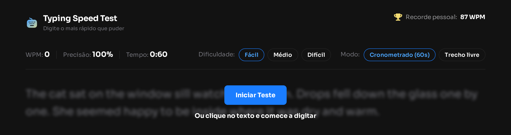

# ⌨️ Typing Speed Test


Um teste de velocidade de digitação rápido e sem dependências: escolha a dificuldade e o modo, digite o trecho exibido na tela e acompanhe WPM, precisão e tempo em tempo real. Seu recorde pessoal fica salvo no navegador entre uma sessão e outra.



## Sumário

- [Funcionalidades](#funcionalidades)
- [Tecnologias](#tecnologias)
- [Como rodar localmente](#como-rodar-localmente)
- [Estrutura do projeto](#estrutura-do-projeto)
- [Detalhes de implementação](#detalhes-de-implementação)
- [Acessibilidade](#acessibilidade)
- [Design](#design)
- [Possíveis próximos passos](#possíveis-próximos-passos)
- [Autor](#autor)
- [Créditos](#créditos)

## Funcionalidades

- **Três níveis de dificuldade** (fácil, médio, difícil), cada um com um banco próprio de trechos em [`data.json`](./data.json)
- **Dois modos de teste**: cronometrado (60s regressivos) ou trecho livre (cronômetro crescente, sem limite de tempo)
- **Feedback caractere a caractere** enquanto digita: acertos em verde, erros em vermelho sublinhado, cursor destacado na posição atual
- **Correção com backspace** — o erro original continua contando pra precisão final, mesmo depois de corrigido
- **Estatísticas ao vivo**: WPM, precisão e tempo, recalculados a cada instante
- **Tela de resultados** com três variações de mensagem: primeiro teste ("Baseline Established!"), novo recorde ("High Score Smashed!", com confete) ou conclusão normal
- **Recorde pessoal persistente** via `localStorage`, mantido entre sessões
- **Reiniciar a qualquer momento**, mesmo no meio do teste, sorteando um novo trecho da mesma dificuldade
- **Totalmente responsivo**: os seletores de dificuldade/modo viram dropdowns no mobile
- **Suporte a teclado e leitor de tela** nos controles principais, incluindo gestão de foco nas trocas de tela (veja [Acessibilidade](#acessibilidade))

## Tecnologias

- HTML5 semântico
- CSS puro — custom properties, Flexbox, media queries (sem pré-processador ou framework)
- JavaScript vanilla (sem build step, sem dependências)
- Fonte [Sora](https://fonts.google.com/specimen/Sora), auto-hospedada

## Como rodar localmente

O app usa `fetch` para carregar o [`data.json`](./data.json), então precisa ser servido por um servidor HTTP local — abrir o `index.html` direto pelo `file://` não funciona por causa de CORS.

```bash
git clone https://github.com/camarottoMD/typing-speed-test.git
cd typing-speed-test

# qualquer servidor estático resolve, por exemplo:
npx serve .
# ou a extensão "Live Server" do VS Code
```

Depois é só abrir o endereço local indicado pelo servidor no navegador.

## Estrutura do projeto

```
├── index.html
├── data.json           # banco de passagens (fácil/médio/difícil)
├── css/
│   └── style.css
├── js/
│   └── app.js
├── assets/             # ícones, fontes e imagens
└── design/             # mockups de referência (desktop/mobile)
```

## Detalhes de implementação

Algumas decisões que talvez não sejam óbvias só de olhar o resultado final:

- **Captura de digitação**: um único `<input>` real (visualmente oculto) recebe o foco e todas as teclas digitadas; o texto exibido é só a renderização visual, um `<span>` por caractere, comparado contra esse valor a cada tecla.
- **Precisão x correções**: os contadores de acerto/erro só crescem — nunca diminuem. Backspace tira a marcação visual do erro, mas ele continua contando na precisão final, como pedido no enunciado do desafio.
- **Dropdown responsivo sem duplicar lógica**: os mesmos botões de dificuldade/modo servem tanto para as pills do desktop quanto para os itens do dropdown mobile — só o CSS muda a aparência conforme o breakpoint.
- **Formato do cronômetro**: o modo cronometrado mostra `0:60 → 0:00` (não `1:00 → 0:00`), reproduzindo fielmente o mockup original em vez do formato `mm:ss` convencional.

## Acessibilidade

- Marcação semântica (`header`, `main`, `section`, `footer`, hierarquia de headings)
- Grupos de dificuldade/modo com `role="radiogroup"` / `role="radio"` e `aria-checked`
- Textos que só mudam visualmente (ex: "Recorde pessoal" → "Melhor" no mobile) continuam completos para leitores de tela
- Estados de foco visíveis (`:focus-visible`) em todos os elementos interativos
- Passagem de texto focável e acionável por teclado (Enter/Espaço iniciam o teste, como um clique)
- Dropdown mobile fecha com `Esc` e devolve o foco ao botão que o abriu
- **Gestão de foco nas trocas de tela**: ao concluir o teste, o foco vai pro heading de resultados; ao clicar em "Repetir", volta pro botão "Iniciar Teste" — quem navega por teclado ou leitor de tela nunca fica "perdido" num elemento desabilitado

## Design

Paleta de cores, tipografia e espaçamentos seguem [`style-guide.md`](./style-guide.md). Os mockups de referência (desktop e mobile, todos os estados) estão em [`/design`](./design).

Baseado no desafio [Typing Speed Test](https://www.frontendmentor.io/challenges/typing-speed-test) do [Frontend Mentor](https://www.frontendmentor.io).

## Possíveis próximos passos

- Suporte a mais idiomas nas passagens de texto
- Histórico local dos últimos testes (não só o recorde)
- Tema claro, além do escuro atual

## Autor

**camarottoMD**
[GitHub](https://github.com/camarottoMD)

## Créditos

- Desafio e mockups: [Frontend Mentor](https://www.frontendmentor.io)
- Fonte: [Sora](https://fonts.google.com/specimen/Sora), por Jonathan Pierini
